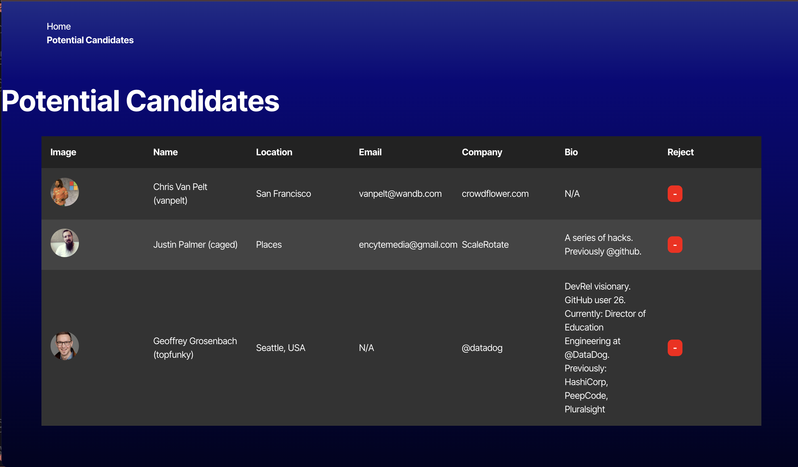

# Candidate Search App
A simple React-based application for discovering and managing potential candidates from GitHub. Users can search for candidates, view their profiles, and save or reject them.

## Table of Contents
* [Features](#features)
* [Technologies Used](#technologies-used)
* [Setup and Installation](#setup-and-installation)
* [Usage](#usage)
* [Screenshots](#screenshots)
* [Contributing](#contributing)
* [License](#license)
* [Deployed link](#deployed-link)

## Features
* Candidate Search: Fetches candidate data from the GitHub API and displays user profiles.
* Save Candidates: Save interesting candidates to a "Saved Candidates" list for later reference.
* Reject Candidates: Skip candidates you’re not interested in and move on to the next one.

## Technologies Used
* Frontend: React, React Router, TypeScript
* Styling: CSS 
* API: GitHub API
* State Management: React Hooks (useState, useEffect)
* Local Storage: Saves and retrieves "Saved Candidates" from local storage.

## Setup and Installation
Follow these steps to get the project running locally:

1. Clone the Repository:Copy code
```
git clone git@github.com:larimae/Indeed.git
```
```
cd candidate-search
```

2. Install Dependencies: Copy code
```
npm install
```

3. Run the Application: Copy code
``` 
npm start
```

4. Navigate to the App

## Usage
1. Search for Candidates:

* The app will display a random candidate fetched from GitHub.
* You can view their details like name, location, company, email, and bio.

2. Save Candidates:

* Click the green + button to save a candidate to the "Saved Candidates" list.

3. Reject Candidates:

* Click the red - button to skip the current candidate and fetch a new one.

4. View Saved Candidates:

* Navigate to the "Saved Candidates" page to view your list of saved profiles.

## Screenshots
Candidate Search Page


Saved Candidates Page


## Contributing
Contributions are welcome! If you'd like to contribute, please follow these steps:

1. Fork the repository.

Create a new branch: Copy code
```
git checkout -b feature-name
```
2. Commit your changes: Copy code
```
git commit -m "Add a new feature"
```

3. Push to the branch: Copy code
```
git push origin feature-name
```

4. Open a pull request.

## License
This project is licensed under the MIT License. See the LICENSE file for more details.

## Deployed Link
https://indeed-7h17.onrender.com